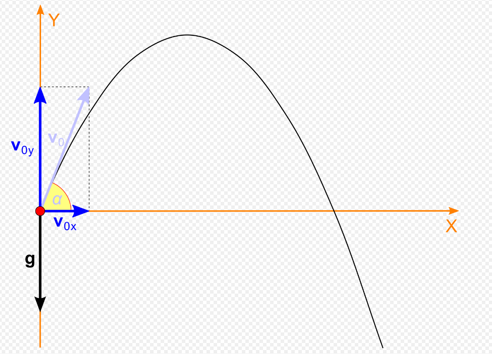
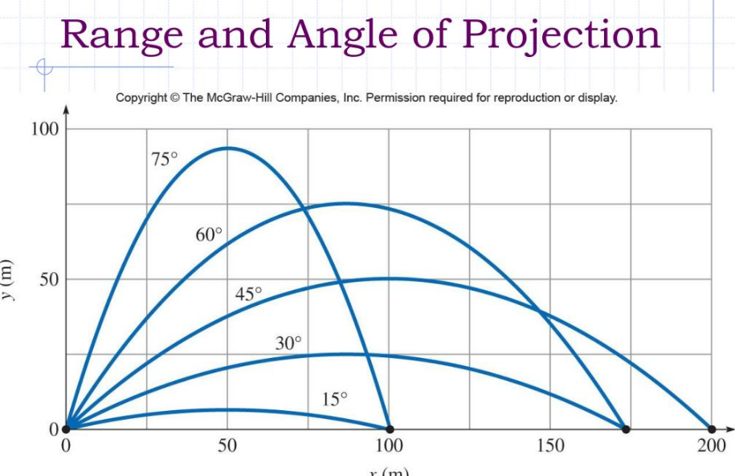
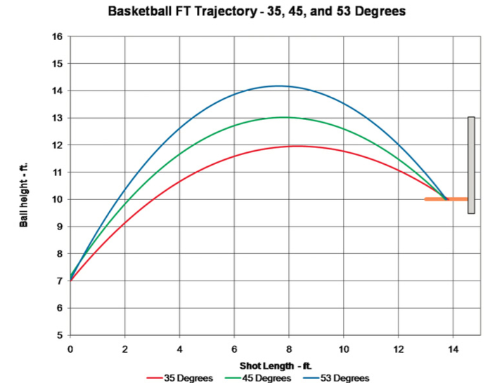
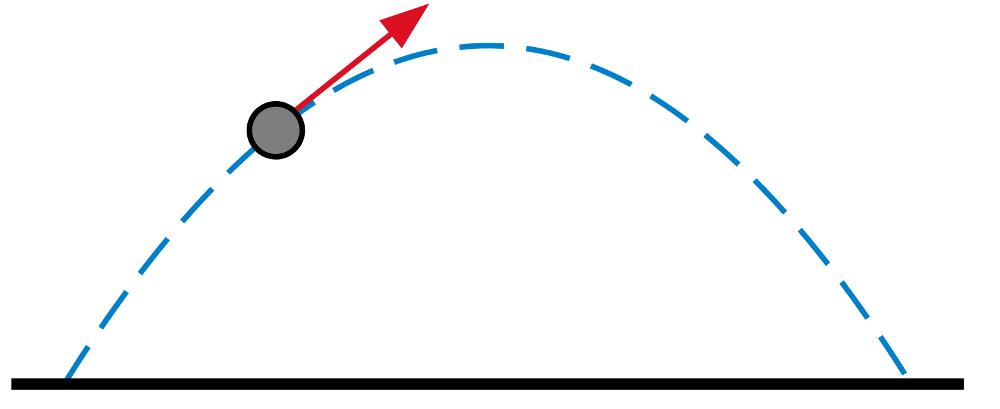
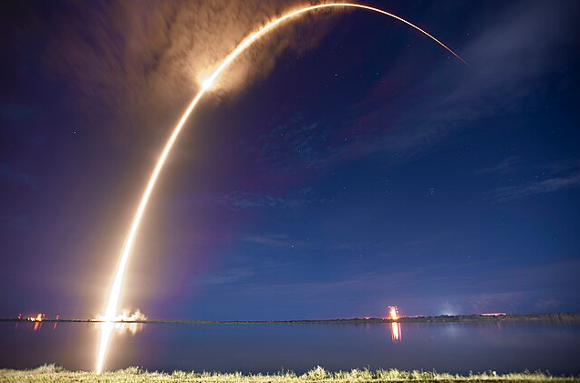

# Problem 1

### Investigating the Range as a Function of the Angle of Projection

####  Theoretical Foundation  
Projectile motion follows Newton’s second law of motion:

$$ F = ma $$

For a projectile launched at an initial velocity $ v_0 $ and angle $ \theta $, the motion can be decomposed into horizontal and vertical components:

- Horizontal motion:  
  $$ x(t) = v_0 \cos(\theta) t $$

- Vertical motion:  
  $$ y(t) = v_0 \sin(\theta) t - \frac{1}{2} g t^2 $$


To find the time of flight ($ T $), we solve for when the projectile returns to the ground ($ y(T) = 0 $):

$$ T = \frac{2 v_0 \sin(\theta)}{g} $$

The range ($ R $) is given by:

$$ R = v_0 \cos(\theta) T $$

Substituting $ T $:

$$ R = \frac{v_0^2 \sin(2\theta)}{g} $$





This shows that **the range depends on the sine of twice the launch angle**.

---

#### Range Analysis
Below is a Python script to analyze the dependency of range on the angle:

```python
import numpy as np
import matplotlib.pyplot as plt

def projectile_range(v0, g):
    angles = np.linspace(0, 90, 100)  # Angles from 0° to 90°
    ranges = (v0**2 * np.sin(2 * np.radians(angles))) / g
    
    plt.figure(figsize=(8, 5))
    plt.plot(angles, ranges, label=f'Initial Velocity = {v0} m/s')
    plt.xlabel("Launch Angle (degrees)")
    plt.ylabel("Range (m)")
    plt.title("Projectile Range vs Launch Angle")
    plt.legend()
    plt.grid()
    plt.show()

# Example: Initial velocity = 20 m/s, g = 9.81 m/s²
projectile_range(20, 9.81)
```



**Observations:**
- The maximum range is achieved at **45°**.
- For angles greater than 45°, the range decreases symmetrically.

---

#### Practical Applications
- **Sports:** Soccer, basketball, and javelin throw rely on optimal launch angles.


Basketball Shooting Angle

- **Military:** Artillery uses similar principles to determine shell trajectories.


Cannonball Trajectories

- **Engineering:** Rocket launches consider projectile motion with atmospheric drag.

Falcon 9 Flight Trajectory
---

#### Computational Implementation
To include air resistance, numerical simulation with differential equations is required:

```python
from scipy.integrate import solve_ivp

def projectile_with_drag(t, y, v0, theta, g, k):
    vx, vy = y[2], y[3]
    v = np.sqrt(vx**2 + vy**2)
    drag_x = -k * v * vx
    drag_y = -k * v * vy - g
    return [vx, vy, drag_x, drag_y]

# Initial conditions
v0, theta, g, k = 20, 45, 9.81, 0.01
initial_conditions = [0, 0, v0 * np.cos(np.radians(theta)), v0 * np.sin(np.radians(theta))]
t_eval = np.linspace(0, 5, 100)

sol = solve_ivp(projectile_with_drag, [0, 5], initial_conditions, t_eval=t_eval, args=(v0, theta, g, k))

plt.plot(sol.y[0], sol.y[1], label="With Air Resistance")
plt.xlabel("x (m)")
plt.ylabel("y (m)")
plt.title("Projectile Motion with Air Resistance")
plt.legend()
plt.grid()
plt.show()
```

🔗 **[Click here to try the simulation](projectile_simulation.html)**
