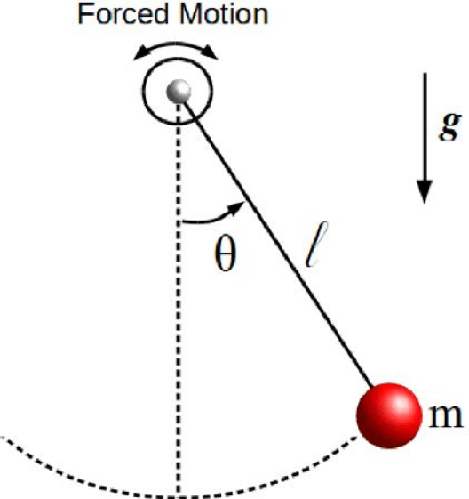
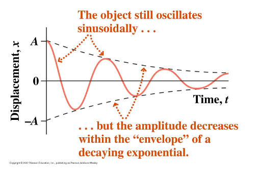
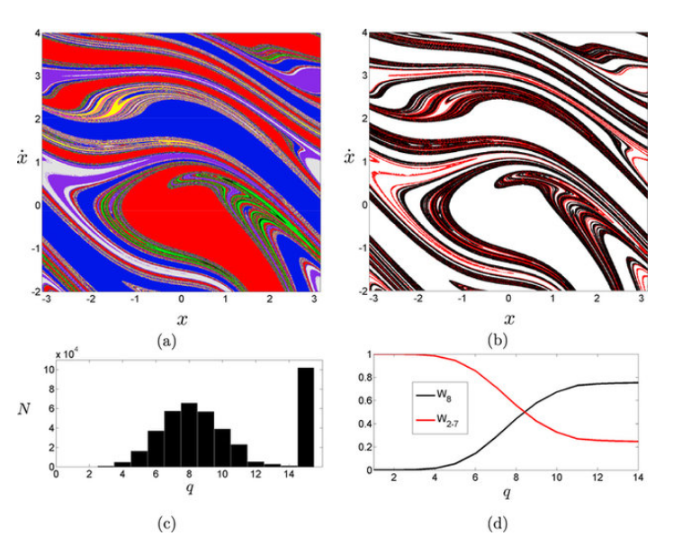
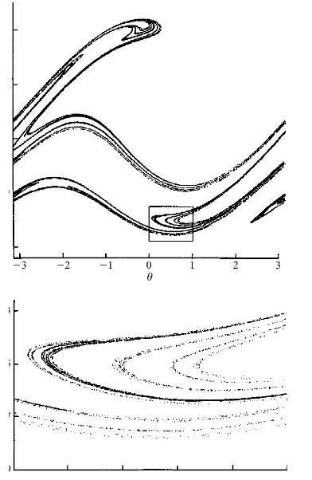

# Problem 2

## **Investigating the Dynamics of a Forced Damped Pendulum**

### **Motivation**
The forced damped pendulum is a **nonlinear dynamical system** that exhibits **complex behaviors** due to the interplay of:
- **Damping forces** (energy loss)
- **Restoring forces** (gravity)
- **External driving forces** (periodic forcing)


Forced Damped Pendulum Diagram

This system transitions from **simple harmonic motion** to more **complex dynamics**, including:
- **Resonance** (amplified oscillations)


Resonance in Forced Damped Pendulum

- **Quasiperiodic behavior**



Quasiperiodic Motion in Forced Damped Pendulu

- **Chaotic motion**



Chaotic Attractor in Forced Damped Pendulum

These behaviors are crucial for understanding real-world systems such as:
- **Driven oscillators** in engineering
- **Climate systems**
- **Mechanical structures under periodic stress**

## **1. Theoretical Foundation**
The equation of motion for a **forced damped pendulum** is given by:

$$
\frac{d^2\theta}{dt^2} + \beta \frac{d\theta}{dt} + \frac{g}{l} \sin(\theta) = \frac{A}{ml} \cos(\omega t)
$$

where:
- $ \theta(t) $ = angular displacement (radians)
- $ \beta $ = damping coefficient
- $ g $ = gravitational acceleration
- $ l $ = pendulum length
- $ A $ = external forcing amplitude
- $ \omega $ = driving frequency

### **Small-Angle Approximation**
For **small oscillations** ($\theta \approx 0$), we approximate:

$$ \sin(\theta) \approx \theta $$

Thus, the equation simplifies to:

$$
\frac{d^2\theta}{dt^2} + \beta \frac{d\theta}{dt} + \frac{g}{l} \theta = \frac{A}{ml} \cos(\omega t)
$$

This resembles a **driven damped harmonic oscillator**, which can be solved analytically.

### **Resonance Condition**
The system resonates when the **driving frequency** matches the **natural frequency**:

$$
\omega_{\text{res}} = \sqrt{\frac{g}{l} - \frac{\beta^2}{4}}
$$

If damping is small ($\beta \approx 0$), we approximate:

$$
\omega_{\text{res}} \approx \sqrt{\frac{g}{l}}
$$

## **2. Analysis of Dynamics**
The system behavior depends on three key parameters:

1. **Damping coefficient ($\beta$)**
   - Low damping → Large oscillations
   - High damping → Suppressed motion

2. **Driving amplitude ($A$)**
   - Small $A$ → Regular periodic motion
   - Large $A$ → Chaotic motion

3. **Driving frequency ($\omega$)**
   - At resonance ($\omega \approx \omega_{\text{res}}$), energy transfer is maximized.
   - Higher frequencies can induce chaos.

## **3. Practical Applications**
The **forced damped pendulum** has several **real-world applications**:

- **Energy harvesting:** Converts oscillations into useful energy.
- **Suspension bridges:** Avoids destructive resonance (e.g., Tacoma Narrows Bridge).
- **Electrical circuits:** Analogous to driven RLC circuits.

## **4. Computational Implementation**
To study the pendulum numerically, we solve the **nonlinear differential equation** using Python.

### **Python Simulation Using Runge-Kutta**
```python
import numpy as np
import matplotlib.pyplot as plt
from scipy.integrate import solve_ivp

# Define parameters
g = 9.81   # Gravity (m/s^2)
l = 1.0    # Pendulum length (m)
beta = 0.5  # Damping coefficient
A = 1.2     # Driving force amplitude
omega = 2.0 # Driving frequency

# Define the equation of motion
def forced_damped_pendulum(t, y):
    theta, omega_dot = y
    dtheta_dt = omega_dot
    domega_dt = -beta * omega_dot - (g / l) * np.sin(theta) + (A / l) * np.cos(omega * t)
    return [dtheta_dt, domega_dt]

# Initial conditions
theta_0 = 0.1  # Initial angle (radians)
omega_0 = 0.0  # Initial angular velocity (radians/s)
y0 = [theta_0, omega_0]

# Time span
t_span = (0, 20)
t_eval = np.linspace(0, 20, 1000)

# Solve the differential equation
sol = solve_ivp(forced_damped_pendulum, t_span, y0, t_eval=t_eval, method='RK45')

# Plot results
plt.figure(figsize=(10,5))
plt.plot(sol.t, sol.y[0], label="Theta (Angle)")
plt.xlabel("Time (s)")
plt.ylabel("Theta (radians)")
plt.title("Forced Damped Pendulum Motion")
plt.legend()
plt.grid()
plt.show()
