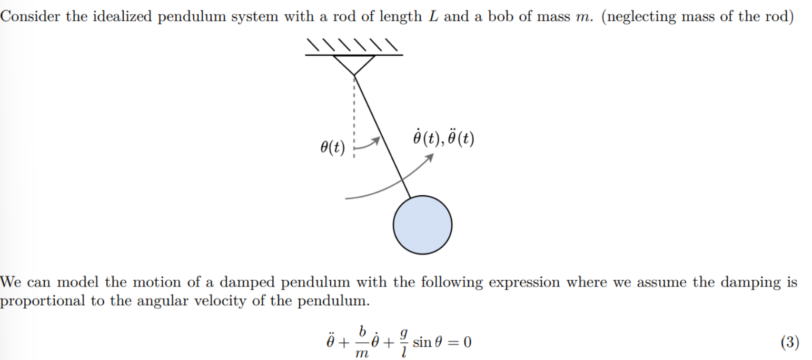
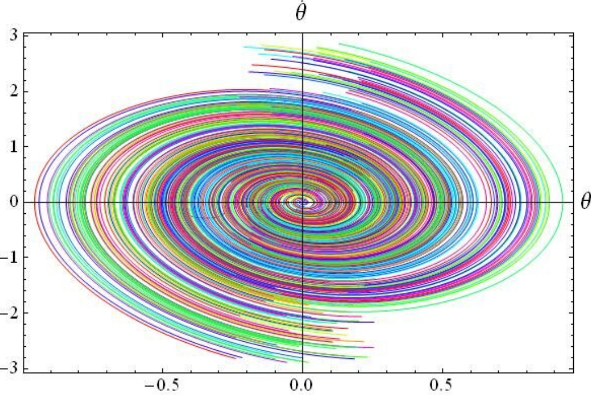
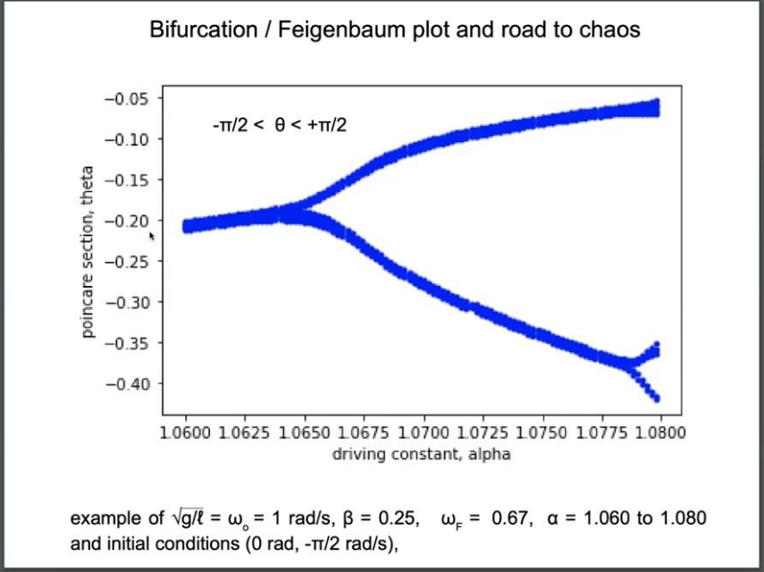
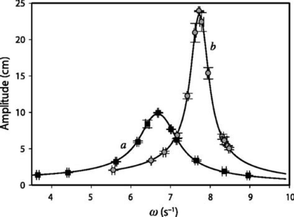
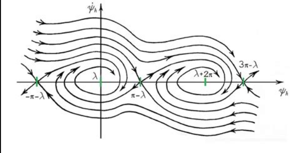

# Problem 2

## **Investigating the Dynamics of a Forced Damped Pendulum**

### **Motivation**
The forced damped pendulum is a **nonlinear dynamical system** that exhibits **complex behaviors** due to the interplay of:
- **Damping forces** (energy loss)
- **Restoring forces** (gravity)
- **External driving forces** (periodic forcing)

Forced Damped Pendulum Diagram

This system transitions from **simple harmonic motion** to more **complex dynamics**, including:
- **Resonance** (amplified oscillations)

Resonance in Forced Damped Pendulum

- **Quasiperiodic behavior**

Quasiperiodic Motion in Forced Damped Pendulu

- **Chaotic motion**

Chaotic Attractor in Forced Damped Pendulum

These behaviors are crucial for understanding real-world systems such as:
- **Driven oscillators** in engineering
- **Climate systems**
- **Mechanical structures under periodic stress**

## **1. Theoretical Foundation**
The equation of motion for a **forced damped pendulum** is given by:

$$
\frac{d^2\theta}{dt^2} + \beta \frac{d\theta}{dt} + \frac{g}{l} \sin(\theta) = \frac{A}{ml} \cos(\omega t)
$$

where:
- $ \theta(t) $ = angular displacement (radians)
- $ \beta $ = damping coefficient
- $ g $ = gravitational acceleration
- $ l $ = pendulum length
- $ A $ = external forcing amplitude
- $ \omega $ = driving frequency

### **Small-Angle Approximation**
For **small oscillations** ($\theta \approx 0$), we approximate:

$$ \sin(\theta) \approx \theta $$

Thus, the equation simplifies to:

$$
\frac{d^2\theta}{dt^2} + \beta \frac{d\theta}{dt} + \frac{g}{l} \theta = \frac{A}{ml} \cos(\omega t)
$$

This resembles a **driven damped harmonic oscillator**, which can be solved analytically.

Small-Angle Approximation Diagram

### **Resonance Condition**
The system resonates when the **driving frequency** matches the **natural frequency**:

$$
\omega_{\text{res}} = \sqrt{\frac{g}{l} - \frac{\beta^2}{4}}
$$

If damping is small ($\beta \approx 0$), we approximate:

$$
\omega_{\text{res}} \approx \sqrt{\frac{g}{l}}
$$

## **2. Analysis of Dynamics**
The system behavior depends on three key parameters:

1. **Damping coefficient ($\beta$)**
   - Low damping → Large oscillations
   - High damping → Suppressed motion

Phase Diagram for Damping Effect

2. **Driving amplitude ($A$)**
   - Small $A$ → Regular periodic motion
   - Large $A$ → Chaotic motion

Bifurcation Diagram for Driving Amplitude

3. **Driving frequency ($\omega$)**
   - At resonance ($\omega \approx \omega_{\text{res}}$), energy transfer is maximized.

Resonance Curves for Forced Oscillator

   - Higher frequencies can induce chaos.

## **3. Practical Applications**
The **forced damped pendulum** has several **real-world applications**:

- **Energy harvesting:** Converts oscillations into useful energy.
- **Suspension bridges:** Avoids destructive resonance (e.g., Tacoma Narrows Bridge).
- **Electrical circuits:** Analogous to driven RLC circuits.

Electrical Circuits and Analogies to Pendulum

## **4. Computational Implementation**
To study the pendulum numerically, we solve the **nonlinear differential equation** using Python.

