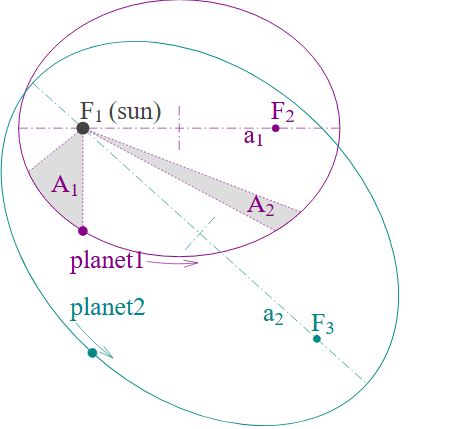
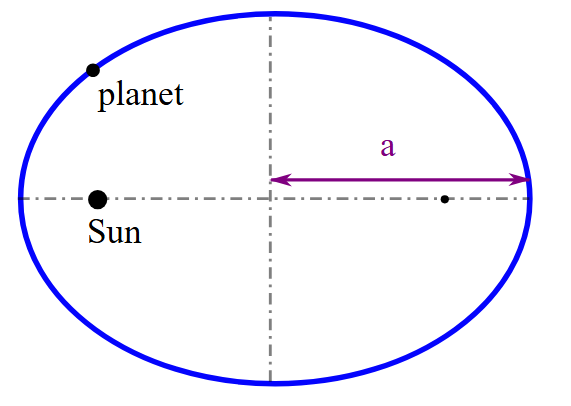
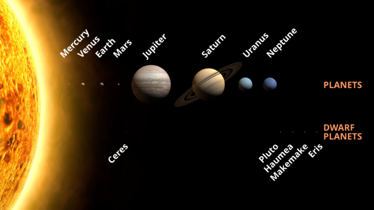
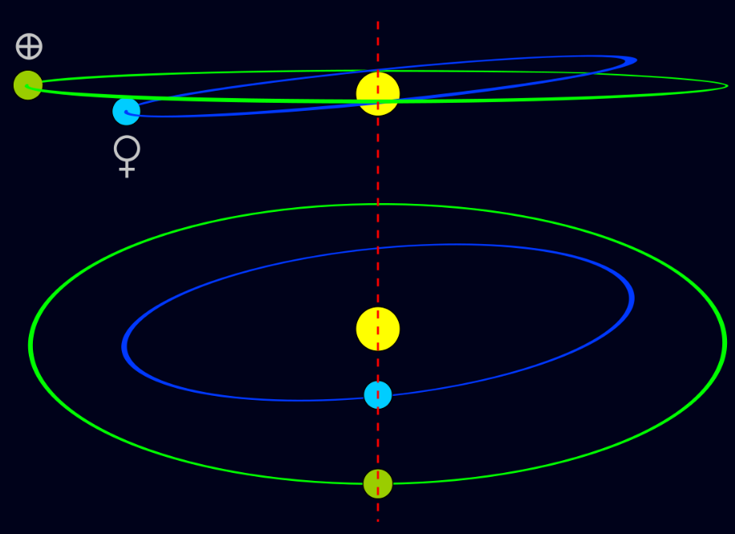
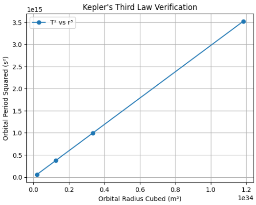

# Problem 1


### **Motivation**

The relationship between the **square of the orbital period** and the **cube of the orbital radius**, known as **Kepler's Third Law**, is a fundamental part of celestial mechanics. It connects Newton’s law of gravitation to observable motion in the universe and helps us understand satellite motion, planetary systems, and more.

---

### **1. Derivation of Kepler’s Third Law (for Circular Orbits)**

Consider a body of mass $m$ orbiting a much more massive body of mass $M$ at radius $r$. The gravitational force provides the centripetal force:

$$
\frac{G M m}{r^2} = \frac{m v^2}{r}
$$



Gravitational force equals centripetal force

Canceling $m$ and solving for $v$:

$$
v^2 = \frac{G M}{r}
$$

We also know:

$$
v = \frac{2\pi r}{T}
$$

Substituting this into the previous equation:

$$
\left( \frac{2\pi r}{T} \right)^2 = \frac{G M}{r}
$$

Solving for $T^2$:

$$
T^2 = \frac{4\pi^2 r^3}{G M}
$$



Plot of T² vs r³ showing linearity

Hence, Kepler’s Third Law:

$$
T^2 \propto r^3
$$

---

### **2. Implications in Astronomy**

- **Mass estimation** of planets or stars using the motion of orbiting bodies.
- **Distance measurements** using observed periods.
- **Understanding system dynamics**, stability, and gravitational influence in celestial systems.

---

### **3. Real-World Examples**

- **Moon's orbit**: Use $T \approx 27.3$ days and $r \approx 3.84 \times 10^8$ m to estimate Earth’s mass.


 *Figure: The Moon's orbit around Earth, showing the relationship between orbital period and radius.*

- **Planetary orbits** in our Solar System: More distant planets have longer orbital periods.



 *Figure: Orbital paths of the planets in the Solar System, highlighting Kepler's Third Law in action.*

- **Exoplanet detection**: Astronomers infer masses and distances using similar principles.



 *Figure: Exoplanet detection using the transit method, where brightness dips reveal orbital properties.*
---

### **4. Python Simulation: Verifying the Law**

```python
import numpy as np
import matplotlib.pyplot as plt

# Constants
G = 6.67430e-11  # gravitational constant in m^3 kg^-1 s^-2
M = 1.989e30     # mass of the sun in kg

# Orbital radii of planets (Mercury to Mars in meters)
radii = np.array([5.79e10, 1.08e11, 1.496e11, 2.279e11])

# Orbital period calculation function
def period(r):
    return 2 * np.pi * np.sqrt(r**3 / (G * M))

# Calculate periods and plot
T = period(radii)
plt.plot(radii**3, T**2, 'o-', label='T² vs r³')
plt.xlabel('Orbital Radius Cubed (m³)')
plt.ylabel('Orbital Period Squared (s²)')
plt.title("Kepler's Third Law Verification")
plt.grid(True)
plt.legend()
plt.show()
```


---

### **5. Elliptical Orbits Extension**

Kepler's Third Law also applies to **elliptical orbits** when using the **semi-major axis** $a$ instead of the radius:

$$
T^2 = \frac{4\pi^2 a^3}{G M}
$$

---

### **Conclusion**

Kepler’s Third Law:

- Unites motion and gravity.
- Is critical for satellite missions, exoplanet studies, and space science.
- Demonstrates how mathematics explains the universe’s structure.

---

[](https://colab.research.google.com/drive/1JiS7tBRUYdaVvTnCahm1P2ishu7JnztA?usp=sharing)
