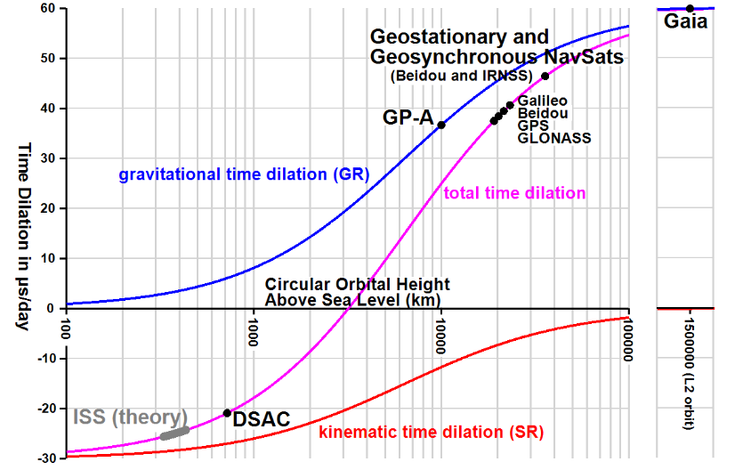
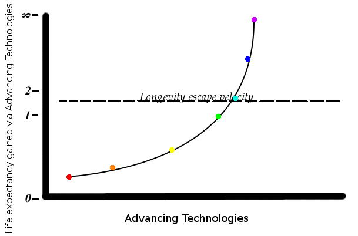
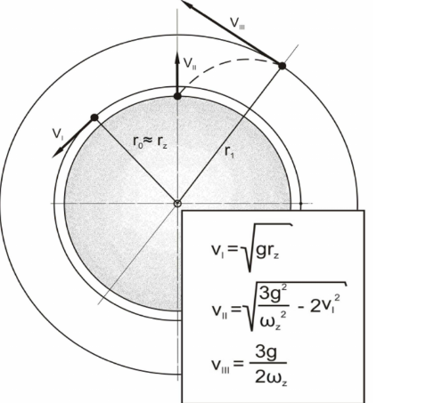
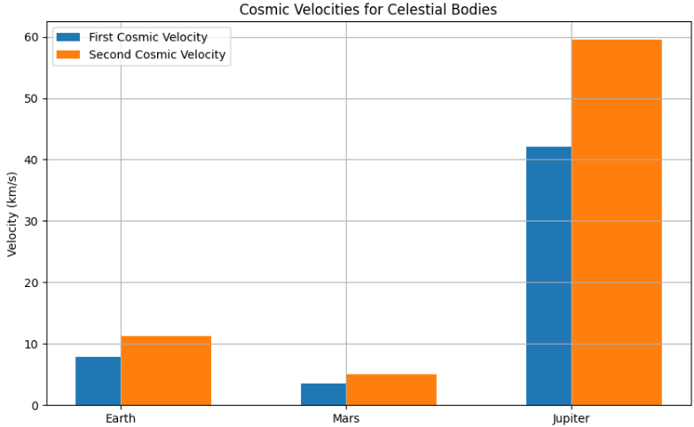

# Problem 2


## **Motivation**

Understanding the various cosmic velocities is essential for space exploration and astrophysics. These velocities define the thresholds required for an object to achieve stable orbits, escape planetary gravitational fields, and even leave star systems. Mastery of these concepts enables the planning and execution of missions ranging from satellite deployments to interplanetary and interstellar travel.

---

## **1. Definitions of Cosmic Velocities**

### **First Cosmic Velocity (Orbital Velocity)**

The **First Cosmic Velocity** is the minimum speed an object must have to enter a stable circular orbit around a celestial body without additional propulsion. This velocity ensures that the object's centrifugal force balances the gravitational pull of the planet.

For a body of mass $M$ and radius $R$, the first cosmic velocity $v_1$ is:

$$
v_1 = \sqrt{\frac{GM}{R}}
$$

Where:
- $G$ is the gravitational constant ($6.67430 \times 10^{-11} \, \text{m}^3\,\text{kg}^{-1}\,\text{s}^{-2}$),
- $M$ is the mass of the celestial body,
- $R$ is the radius from the center of the celestial body to the object.

---



*Figure: Orbital velocity as a function of altitude for the Earth.*


### **Second Cosmic Velocity (Escape Velocity)**

The **Second Cosmic Velocity** is the minimum speed required for an object to break free from a celestial body's gravitational influence without further propulsion. It is derived from equating the kinetic energy to the gravitational potential energy:

$$
v_2 = \sqrt{\frac{2GM}{R}}
$$

Note: $v_2 = \sqrt{2} \cdot v_1$




*Figure: Escape velocity concept diagram showing gravitational energy vs kinetic energy.*

---

### **Third Cosmic Velocity**

The **Third Cosmic Velocity** is the minimum speed needed for an object to escape the gravitational influence of the Sun, effectively leaving the Solar System. This velocity depends on the object's position relative to the Sun and is influenced by both the Earth's orbital velocity and the additional speed required to overcome the Sun's gravity.




*Figure: Vector representations and formulas of the first, second, and third cosmic velocities.*


---

## **2. Mathematical Derivations and Influencing Parameters**

### **First Cosmic Velocity Derivation**

Balance of gravitational and centripetal forces:

$$
\frac{GMm}{R^2} = \frac{mv^2}{R}
$$

Solving for $v$:

$$
v = \sqrt{\frac{GM}{R}}
$$

---

### **Second Cosmic Velocity Derivation**

Setting kinetic energy equal to gravitational potential energy:

$$
\frac{1}{2}mv^2 = \frac{GMm}{R}
$$

Solving for $v$:

$$
v = \sqrt{\frac{2GM}{R}}
$$

---

### **Factors Affecting Cosmic Velocities**
- **Mass ($M$):** Larger mass → stronger gravity → higher velocity.
- **Radius ($R$):** Larger radius → weaker gravity → lower velocity.

---

## **3. Calculations for Earth, Mars, and Jupiter**

### Constants:

- $G = 6.67430 \times 10^{-11} \, \text{m}^3\,\text{kg}^{-1}\,\text{s}^{-2}$

---

### **Earth**  
- $M = 5.972 \times 10^{24}$ kg  
- $R = 6.371 \times 10^6$ m

$$
v_1 = \sqrt{\frac{6.67430 \times 10^{-11} \cdot 5.972 \times 10^{24}}{6.371 \times 10^6}} \approx 7.91 \, \text{km/s}
$$

$$
v_2 = \sqrt{2} \cdot 7.91 \approx 11.2 \, \text{km/s}
$$

---

### **Mars**  
- $M = 6.4171 \times 10^{23}$ kg  
- $R = 3.3895 \times 10^6$ m

$$
v_1 = \sqrt{\frac{6.67430 \times 10^{-11} \cdot 6.4171 \times 10^{23}}{3.3895 \times 10^6}} \approx 3.55 \, \text{km/s}
$$

$$
v_2 = \sqrt{2} \cdot 3.55 \approx 5.03 \, \text{km/s}
$$

---

### **Jupiter**  
- $M = 1.898 \times 10^{27}$ kg  
- $R = 6.9911 \times 10^7$ m

$$
v_1 = \sqrt{\frac{6.67430 \times 10^{-11} \cdot 1.898 \times 10^{27}}{6.9911 \times 10^7}} \approx 42.1 \, \text{km/s}
$$

$$
v_2 = \sqrt{2} \cdot 42.1 \approx 59.5 \, \text{km/s}
$$

---

### **Visualization with Python**

```python
import matplotlib.pyplot as plt

bodies = ['Earth', 'Mars', 'Jupiter']
v1 = [7.91, 3.55, 42.1]
v2 = [11.2, 5.03, 59.5]

x = range(len(bodies))

plt.figure(figsize=(10, 6))
plt.bar(x, v1, width=0.4, label='First Cosmic Velocity', align='center')
plt.bar(x, v2, width=0.4, label='Second Cosmic Velocity', align='edge')
plt.xticks(x, bodies)
plt.ylabel('Velocity (km/s)')
plt.title('Cosmic Velocities for Celestial Bodies')
plt.legend()
plt.grid(True)
plt.show()
```



---

## **4. Importance in Space Exploration**

- **First Cosmic Velocity:** Needed to place satellites into orbit.
- **Second Cosmic Velocity:** Required to launch missions to other planets.
- **Third Cosmic Velocity:** Used in missions aimed at exiting the Solar System.

These principles form the basis of orbital mechanics and interplanetary mission planning.

---

## **Conclusion**

The cosmic velocities offer insight into how gravity controls motion in space. Understanding and calculating these values is essential for mission design and predicting object trajectories in astrophysics.


[](https://colab.research.google.com/drive/1tC3id58NIYNFc1G2ti9dI6ouuYYUNcEQ?usp=sharing)